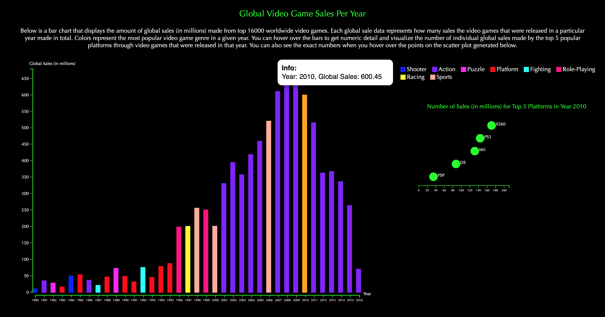

# Video Game Sales Visualization with D3

[Video Game Sales Dataset](https://www.kaggle.com/gregorut/videogamesales#vgsales.csv) (Additional data is collected by using Pandas & Python which can be found in this repository)

[Live demo](https://gizemdal.github.io/Video-Game-Sales/)

## Summary

This visualization consists of a bar chart that displays the amount of global sales (in millions) made from top 16000 worldwide video games (dataset is filtered to contain data up to 2016). Each global sale data represents how many sales the video games that were released in a particular year made in total. Colors represent the most popular video game genre in a given year. You can hover over the bars to get numeric detail and visualize the number of individual global sales made by the top 5 popular platforms through video games that were released in that year. You can also see the exact numbers when you hover over the points on the scatter plot generated.
